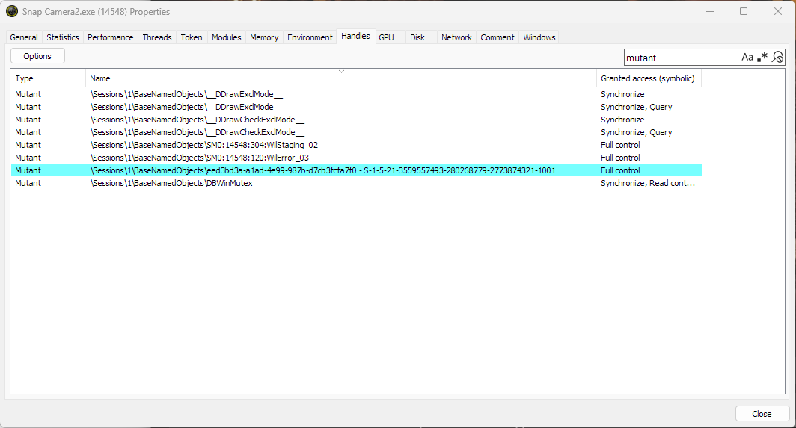
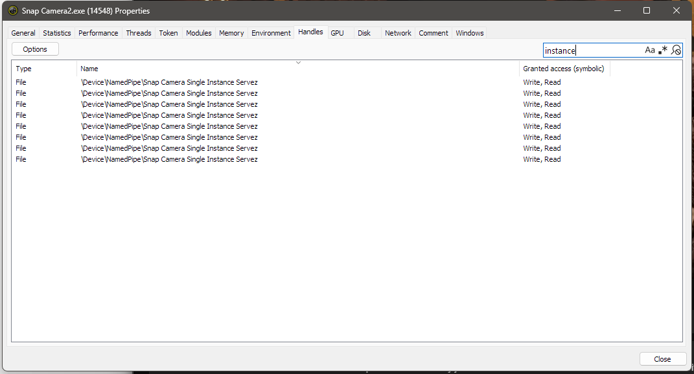
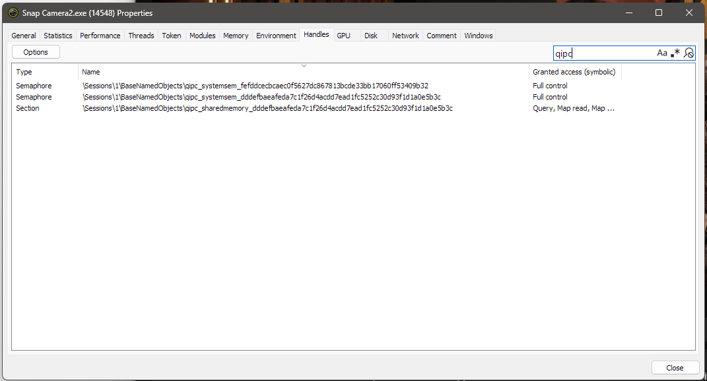

# snap-chain

Run two chained Snap Camera instances simultaneously. The output of the first instance (SC1) is fed into the second (SC2) via a virtual camera bridge, allowing you to stack filters. Both feeds are captured via Frida GL hooks, displayed in real-time, and pushed to Unity Capture virtual camera devices for use in OBS or other tools.

```
Webcam → SC1 (filter A) → Unity Capture Device 0 → SplitCam → SC2 (filter B) → Unity Capture Device 1
```

---

## Prerequisites

- [Snap Camera](https://snapcamera.snapchat.com/) — original installer
- [snap-camera-server](https://github.com/ptrumpis/snap-camera-server) — self-hosted lens server (required since Snap Camera's official servers are shut down)
- [SplitCam](https://splitcam.com/) (or similar) — bridges SC1's output to SC2's input
- [System Informer](https://systeminformer.io/) — used to close handles that prevent multiple Snap Camera instances
- [UnityCapture](https://github.com/schellingb/UnityCapture) — virtual camera driver for output
- Python 3.10+

```
pip install frida frida-tools opencv-python numpy pyvirtualcam
```

---

## Installation

### 1. Set up snap-camera-server
Follow the instructions at [ptrumpis/snap-camera-server](https://github.com/ptrumpis/snap-camera-server). It must be running before you launch Snap Camera.

### 2. Create a second Snap Camera executable
Copy `Snap Camera.exe` in its installation directory and rename the copy to `Snap Camera2.exe`.

```
C:\Program Files\Snap Inc\Snap Camera\Snap Camera.exe   ← original (SC1)
C:\Program Files\Snap Inc\Snap Camera\Snap Camera2.exe  ← copy (SC2)
```

### 3. Install Unity Capture
Download `UnityCaptureFilter32.dll` and `UnityCaptureFilter64.dll` from the [UnityCapture releases page](https://github.com/schellingb/UnityCapture/releases) and place them in the project folder. Register them with:

```
regsvr32 UnityCaptureFilter64.dll
regsvr32 UnityCaptureFilter32.dll
```

### 4. Clone this repo
```
git clone https://github.com/aptaunk/snap-chain.git
cd snap-chain
```

---

## Usage

Start everything in this order:

**1.** Start **snap-camera-server**

**2.** Open **SC1** (`Snap Camera.exe`), select your webcam as input and apply a filter

**3.** Close the single-instance handles in SC1 using System Informer (see below)

**4.** Open **SplitCam**, set its source to **Unity Video Capture** (Device 0)

**5.** Open **SC2** (`Snap Camera2.exe`), set its input to **SplitCam Video Driver** and apply a filter

**6.** Run the script:
```
python snap_viewer.py
```

**7.** Select the correct texture for each feed from the dropdowns

---

## Closing handles in System Informer

Snap Camera uses several handles to enforce a single-instance limit. After SC1 is running, open System Informer, find `Snap Camera.exe` in the process list, double-click it, and go to the **Handles** tab. Close the following handles in any order (the exact names will vary between machines and sessions — identify them by pattern):

### 1. Mutant (UUID–SID)
Search **`mutant`**. Close the handle highlighted in blue — it is the only one with **Full control** access and has a name matching the pattern:

`\Sessions\1\BaseNamedObjects\<UUID> - <SID>`



### 2. Named pipe
Search **`instance`**. Close all File handles named:

`\Device\NamedPipe\Snap Camera Single Instance Servez`



### 3. QIPC objects
Search **`qipc`**. Close all 3 rows (2 Semaphores and 1 Section):

`\Sessions\1\BaseNamedObjects\qipc_...`



> To close a handle: right-click it → **Close**.
>
> It is not confirmed which of these are strictly necessary — closing all three groups is known to work.

---

## Output

- **Unity Capture Device 0** — SC1 output (also the source SplitCam reads from)
- **Unity Capture Device 1** — SC2 output (use this in OBS or other recording tools)
